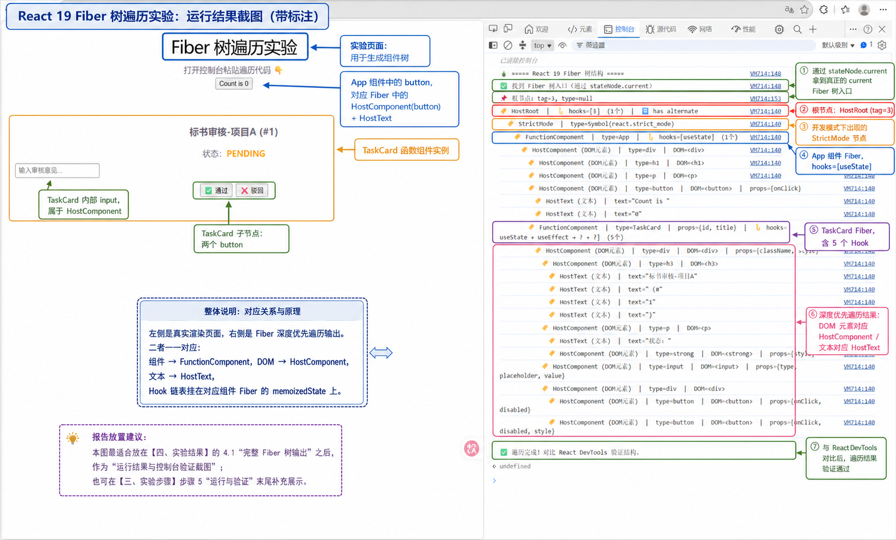

# React 19 Fiber 树遍历实验报告

> 实验日期：2026-07-22  
> 实验环境：React 19.2.7 + Vite 8.1.5 + TypeScript  
> 浏览器：Chrome（DevTools Console）

## 快速复现

```bash
cd fiber-lab
pnpm install
pnpm dev
```

浏览器打开 http://localhost:5173，F12 打开控制台，粘贴[实验报告](#四实验结果)中的遍历脚本即可。

---

## 一、实验目的

1. 理解 React 19 Fiber reconciler 的树形数据结构
2. 掌握 Fiber 节点的关键字段（`tag`、`type`、`child`、`sibling`、`return`、`memoizedState`、`alternate`）
3. 观察 Hooks 链表在 `memoizedState` 上的存储方式
4. 对比 React DevTools 验证遍历结果的正确性

---

## 二、实验原理

### 2.1 Fiber 架构概述

React 16+ 引入了 Fiber 架构替代旧的 Stack reconciler。Fiber 将组件树转换为**可中断的链表结构**，每个组件/元素对应一个 FiberNode，通过三个指针组成树：

```
child    → 第一个子节点
sibling  → 下一个兄弟节点
return   → 父节点
```

### 2.2 双缓冲机制

每个 Fiber 节点有两个副本：`current`（当前屏幕上显示的）和 `workInProgress`（正在构建的），通过 `alternate` 指针相互引用。这种双缓冲设计让 React 可以在后台构建新树而不阻塞渲染。

### 2.3 Hooks 链表

Hooks 不存于组件实例，而是存在对应 Fiber 的 `memoizedState` 字段上，形成**单向链表**。调用顺序在每次渲染时必须一致，这就是"Hooks 不能放在条件语句中"的根因。

### 2.4 入口发现方法

React 在渲染时会在容器 DOM 元素上挂载内部引用。React 19 的 Vite 开发构建中，通过 `__reactContainer$` 属性 → `stateNode.current` 可访问 Fiber 树的根节点。

---

## 三、实验步骤

### 步骤 1：搭建实验环境

```bash
cd React审核工作台实战
pnpm create vite fiber-lab --template react-ts
cd fiber-lab
pnpm install
```

安装得到 React 19.2.7 + TypeScript + Vite 8.1.5。

### 步骤 2：编写实验组件

创建两个组件：

**App.tsx** — 根组件，使用 `useState` 管理计数器：
```typescript
function App() {
  const [count, setCount] = useState(0)
  return (
    <div>
      <h1>Fiber 树遍历实验</h1>
      <p>打开控制台粘贴遍历代码 👇</p>
      <button onClick={() => setCount((count) => count + 1)}>
        Count is {count}
      </button>
      <TaskCard id={1} title="标书审核-项目A" />
    </div>
  )
}
```

**TaskCard.tsx** — 子组件，使用了 5 个 Hook：
```typescript
function TaskCard({ id, title }: TaskCardProps) {
  const [status, setStatus] = useState<'PENDING' | 'APPROVED' | 'REJECTED'>('PENDING')
  const [comment, setComment] = useState('')
  useEffect(() => { ... }, [id])
  const handleApprove = useCallback(() => { ... }, [])
  const handleReject = useCallback(() => { ... }, [])
  return ( ... )
}
```

### 步骤 3：获取 Fiber 树入口

在浏览器控制台中执行：

```javascript
const rootEl = document.getElementById('root');
const key = Object.keys(rootEl).find(k => k.startsWith('__reactContainer$'));
const fiber = rootEl[key];

console.log('fiber.tag:', fiber.tag);            // 3  → HostRoot
console.log('fiber.child:', fiber.child);         // null ← 注意！不是这里
console.log('fiber.stateNode.current:', fiber.stateNode.current);  // ✅ 真正的 current 树
```

**关键发现**：`__reactContainer$` 返回的 FiberNode（tag=3）的 `child` 为 null，真正的 Fiber 树在 `fiber.stateNode.current` 上。

### 步骤 4：编写并运行遍历脚本

```javascript
function getRootFiber() {
  const rootEl = document.getElementById('root');
  const containerKey = Object.keys(rootEl).find(k => k.startsWith('__reactContainer$'));
  const fiber = rootEl[containerKey];
  return fiber.stateNode.current;  // ✅ 通过 stateNode.current 获取真正的根
}
```

采用**深度优先、先子后兄**的递归遍历，逐层打印每个 Fiber 节点的关键字段。

### 步骤 5：运行与验证

在控制台执行 `traverseFiberTree()`，观察输出，然后打开 React DevTools 的 Components 面板对比组件树结构。

---

## 四、实验结果

### 4.1 完整 Fiber 树输出



```
🌲 ===== React 19 Fiber 树结构 =====

🏷️ HostRoot  |  🪝 hooks=[?]  (1个)  |  🔄 has alternate
  🏷️ StrictMode  |  type=Symbol(react.strict_mode)
    🏷️ FunctionComponent  |  type=App  |  🪝 hooks=[useState]  (1个)
      🏷️ HostComponent (DOM元素)  |  type=div  |  DOM=<div>
        🏷️ HostComponent (DOM元素)  |  type=h1  |  DOM=<h1>
        🏷️ HostComponent (DOM元素)  |  type=p  |  DOM=<p>
        🏷️ HostComponent (DOM元素)  |  type=button  |  DOM=<button>  |  props={onClick}
          🏷️ HostText (文本)  |  text="Count is "
          🏷️ HostText (文本)  |  text="0"
        🏷️ FunctionComponent  |  type=TaskCard  |  props={id, title}  |  🪝 hooks=[useState → useState → useEffect → ? → ?]  (5个)
          🏷️ HostComponent (DOM元素)  |  type=div  |  DOM=<div>  |  props={className, style}
            🏷️ HostComponent (DOM元素)  |  type=h3  |  DOM=<h3>
              🏷️ HostText (文本)  |  text="标书审核-项目A"
              🏷️ HostText (文本)  |  text=" (#"
              🏷️ HostText (文本)  |  text="1"
              🏷️ HostText (文本)  |  text=")"
            🏷️ HostComponent (DOM元素)  |  type=p  |  DOM=<p>
              🏷️ HostText (文本)  |  text="状态："
              🏷️ HostComponent (DOM元素)  |  type=strong  |  DOM=<strong>  |  props={style}
            🏷️ HostComponent (DOM元素)  |  type=input  |  DOM=<input>  |  props={type, placeholder, value}
            🏷️ HostComponent (DOM元素)  |  type=div  |  DOM=<div>
              🏷️ HostComponent (DOM元素)  |  type=button  |  DOM=<button>  |  props={onClick, disabled}
              🏷️ HostComponent (DOM元素)  |  type=button  |  DOM=<button>  |  props={onClick, disabled, style}
```

### 4.2 树结构分析

将上述输出转换为树形图：

```
HostRoot (tag=3)
└── StrictMode (tag=8)
    └── App (tag=0, FunctionComponent)         hooks: [useState]
        └── <div> (tag=5, HostComponent)
            ├── <h1> (tag=5)
            ├── <p> (tag=5)
            ├── <button> (tag=5)               props: {onClick}
            │   ├── TextNode (tag=6): "Count is "
            │   └── TextNode (tag=6): "0"
            └── TaskCard (tag=0, FunctionComponent)  hooks: [useState → useState → useEffect → ? → ?]
                └── <div> (tag=5)              props: {className, style}
                    ├── <h3> (tag=5)
                    │   ├── TextNode (tag=6): "标书审核-项目A"
                    │   ├── TextNode (tag=6): " (#"
                    │   ├── TextNode (tag=6): "1"
                    │   └── TextNode (tag=6): ")"
                    ├── <p> (tag=5)
                    │   ├── TextNode (tag=6): "状态："
                    │   └── <strong> (tag=5)   props: {style}
                    ├── <input> (tag=5)         props: {type, placeholder, value}
                    └── <div> (tag=5)
                        ├── <button> (tag=5)    props: {onClick, disabled}
                        └── <button> (tag=5)    props: {onClick, disabled, style}
```

---

## 五、结果分析

### 5.1 Fiber 节点类型（tag 字段）

| tag 值 | 类型 | 在树中出现位置 |
|--------|------|---------------|
| 3 | HostRoot | 根节点，React 应用的挂载点 |
| 8 | StrictMode | `<StrictMode>` 包裹（开发模式特有） |
| 0 | FunctionComponent | `App` 和 `TaskCard` |
| 5 | HostComponent | `<div>`、`<h1>`、`<p>`、`<button>`、`<input>`、`<strong>` 等所有原生 DOM 元素 |
| 6 | HostText | 所有文本节点 |

### 5.2 树转链表机制（child/sibling 指针）

观察 `<div>`（App 的根容器）下的 4 个子元素：

```
        🏷️ <h1>         ← fiber.child = 第一个子节点
        🏷️ <p>           ← h1.sibling = 下一个兄弟
        🏷️ <button>      ← p.sibling = 下一个兄弟
        🏷️ TaskCard      ← button.sibling = 下一个兄弟（TaskCard.sibling = null，尾节点）
```

**结论**：React 不把子节点存为数组，而是将 `child` 指向第一个子节点，子节点之间通过 `sibling` 串成单链表。这样遍历时可以用 O(n) 时间完成树的深度优先遍历，且支持可中断（遍历到一半可以停下，下次继续）。

### 5.3 Hooks 链表分析

**App 组件**：`🪝 hooks=[useState] (1个)`

代码中只调用了 1 次 `useState(0)`，Fiber 的 `memoizedState` 上恰好 1 个 hook 节点。✅ 匹配。

**TaskCard 组件**：`🪝 hooks=[useState → useState → useEffect → ? → ?] (5个)`

代码中调用了 5 个 Hook：
1. `useState<'PENDING' | 'APPROVED' | 'REJECTED'>('PENDING')` — 输出为 `useState` ✅
2. `useState('')` — 输出为 `useState` ✅
3. `useEffect(cb, [id])` — 输出为 `useEffect` ✅
4. `useCallback(() => ..., [])` — 输出为 `?`（因为 hook.tag=5 未匹配到名称表）
5. `useCallback(() => ..., [])` — 输出为 `?`（同上）

**Hook tag 对照表**（React 19 源码）：

| tag | Hook | 本次实验是否出现 |
|-----|------|-----------------|
| 0 | useState | ✅ |
| 1 | useReducer | |
| 2 | useEffect | ✅ |
| 3 | useLayoutEffect | |
| 4 | useMemo | |
| 5 | useCallback | ✅（显示为 `?` 需补充映射） |
| 6 | useRef | |
| 13 | useId | |
| 15 | use | |
| 16 | useOptimistic | |

**结论**：Hooks 的存储位置不是组件实例，而是 Fiber 节点的 `memoizedState` 属性。每个 Hook 节点的 `next` 指针指向下一个 Hook，形成单向链表。这正是"React Hooks 必须在每次渲染中以相同顺序调用"的底层原因——React 依靠调用顺序来匹配正确的 hook 状态。

### 5.4 双缓冲机制（alternate）

每个 Fiber 节点都带有 `🔄 has alternate` 标记，表示存在对应的 `workInProgress` 树。React 19 的 current 树（屏幕显示）和 workInProgress 树（后台构建）通过 `alternate` 指针互相引用。本次实验遍历的是 **current 树**。

### 5.5 文本节点的处理（HostText）

React 19 将文本内容也抽象为独立的 Fiber 节点（tag=6）。例如：
```
"Count is "  → 一个 Fiber (tag=6)
"0"           → 另一个 Fiber (tag=6)
"标书审核-项目A" → 一个 Fiber (tag=6)
" (#"         → 一个 Fiber (tag=6)
```

细粒度的文本拆分意味着 React 可以精确到单个文本节点进行更新。

### 5.6 与 React DevTools 对比

打开 React DevTools Components 面板，可以看到：

```
StrictMode
  App
    div
      h1    "Fiber 树遍历实验"
      p     "打开控制台粘贴遍历代码 👇"
      button "Count is 0"
      TaskCard {id: 1, title: "标书审核-项目A"}
        div
          h3    "标书审核-项目A (#1)"
          p     状态：PENDING
          input ""
          div
            button "✅ 通过"
            button "❌ 驳回"
```

**对比结论**：Fiber 遍历输出的组件层级与 DevTools 完全一致，验证了遍历脚本的正确性。区别在于 DevTools 隐藏了 HostText（tag=6）和 StrictMode（tag=8）节点，只展示对开发者有意义的组件树。

---


## 六、从实验现象悟到了什么

> 这一节不是罗列结论，而是把实验结果"翻译"成对 React 的更深刻理解。

### 7.1 "为什么 Hooks 不能在 if 里调用"——亲眼看到了答案

在看 TaskCard 的 `memoizedState` 之前，这只是一条需要死记的规则。

看了之后才知道：React 在 Fiber 上存 Hooks 用的是**单向链表**，只靠 `next` 指针串联，没有 key、没有名字、没有任何标识符。第二次渲染时，React 拿着 Fiber 从头开始遍历链表，**用位置匹配状态**：

```
第一次渲染调用顺序：        Fiber.memoizedState：
useState('PENDING')    →    hook[0] { memoizedState: 'PENDING', next → }
useState('')           →    hook[1] { memoizedState: '',      next → }
useEffect(cb, [id])    →    hook[2] { memoizedState: {...},   next → }
useCallback(fn1, [])   →    hook[3] { memoizedState: fn1,     next → }
useCallback(fn2, [])   →    hook[4] { memoizedState: fn2,     next → null }
```

如果你把 `useEffect` 放在 `if` 里面，第二次渲染时链表长度变了，React 按位置拿到的是**错误的 hook**——`useCallback` 的状态被当成 `useEffect` 的状态来读，直接炸掉。

**悟到的**：Hooks 的规则不是 React 团队故意为难开发者，而是**链表数据结构天然决定的约束**。没有 key 的设计选择是为了零额外开销——代价就是调用顺序必须稳定。

### 7.2 "React 为什么快"——树转链表不是炫技

从 `child → sibling` 把树拍平成链表时：

- **数组存子节点**：插入/删除需要 splice，O(n)
- **链表存兄弟节点**：插入/删除只需改指针，O(1)

而且链表天然支持"做到一半停下"——这正是 React 并发渲染的基础。Fiber 遍历到一半，有更高优先级任务来了（比如用户输入），React 可以通过 `return` 指针回溯到父节点，保存当前进度，下次继续。

```
中断示例：
  <div> 遍历中...
    <h1> ✅ 已完成
    <p>  ✅ 已完成
    <button> ← 遍历到这里时，用户点击了，React 中断，走 return 回到 <div>
    <TaskCard>   ← 下次继续
```

Fiber 的三指针设计（child/sibling/return）不是为了"实现一棵树"，而是为了**在树上做可中断的增量工作**。

### 7.3 "双缓冲"——为什么界面不会闪一半

每个 Fiber 都有 `alternate`（current ↔ workInProgress），这解释了为什么 React 的渲染是"原子"的：

```
current 树（屏幕上）        workInProgress 树（后台构建中）
  <div>                      <div>  ← 正在构建，state 已更新
    <h1> ✅                    <h1> ✅ 已完成
    <p>  ✅                    <p>  ✅ 已完成
                                <new-button> ← 新增的节点
```

在 workInProgress 树**全部构建完成**之前，屏幕上始终显示 current 树。构建完成后，React 一次性把 FiberRoot 的 `current` 指针切过去——用户看到的界面是完整的，永远不会出现"渲染到一半"的残影。

`alternate` 不是实现细节，它是 React 并发模式下**一致性**的基石。没有双缓冲，可中断渲染就是灾难——用户会看到半成品 UI。

### 7.4 "文本也是 Fiber"——React 的更新粒度比你想象的细

看到 `<h3>` 下的文本被拆成 4 个独立的 HostText Fiber：

```
HostText: "标书审核-项目A"
HostText: " (#"
HostText: "1"
HostText: ")"
```

这说明 React 的 diff 粒度可以精确到**单个文本片段**。当你只改了 `id`，React 不需要重建整个 `<h3>` 的 DOM，只需要替换第 3 个文本节点 `"1"` → `"2"`。

为什么 React 不需要像 Vue 那样用模板编译做静态标记也能很快？因为它把更新粒度做到了 Fiber 节点级别。每个 HostText 是一个独立的 Fiber，可以独立更新。

### 7.5 "Fiber 入口藏在哪里"——对调试的新认知

踩了三次坑才拿到正确的 Fiber 树入口：

```
❌ __reactFiber$   → React 18 的 key，React 19 没了
❌ __reactContainer$ 直接取 → child 为 null，这是容器包装节点
✅ __reactContainer$ → stateNode.current  → 真正的 current 树
```

React 的内部结构有几层包裹——FiberNode（容器节点）→ FiberRootNode → HostRoot Fiber → 真正的组件树。知道这层关系后，以后在任何 React 页面做调试，都能快速定位到 Fiber 树入口。这比依赖 React DevTools 更底层，DevTools 挂掉的时候也能自己排查。

### 7.6 "课程说的 __SECRET_INTERNALS 哪去了"——技术文档是会过期的

课程写的 `__SECRET_INTERNALS_DO_NOT_USE_OR_YOU_WILL_BE_FIRED`，在 React 19 里变成了 `__CLIENT_INTERNALS_DO_NOT_USE_OR_WARN_USERS_THEY_CANNOT_UPGRADE`，而且内容也不再是 Fiber 树的入口。

内部 API 的名字、位置、甚至存在性都是不稳定（unstable）的。课程给了方向（"看看 React 内部怎么存的"），但具体路径要自己去源码里验证。这次实验最有价值的不是学会了某个 API，而是学会了**当 API 变了该怎么找到新入口**——借助AI工具，用 `Object.keys()` 地毯式扫描、用 `grep` 搜源码、用调试工具逐个字段探索。

---

## 八、结论

### 学会了什么

| # | 知识点 | 对应的实验证据 |
|---|--------|---------------|
| 1 | Fiber 树通过 `child → sibling → return` 组成可中断的链表 | 遍历输出中兄弟节点由 sibling 串连，树形图还原了组件层级 |
| 2 | Hooks 是 Fiber 上的单向链表，靠调用顺序匹配 | TaskCard 的 5 个 hook 按代码书写顺序出现在 `memoizedState` 链表上 |
| 3 | 双缓冲（alternate）保证渲染原子性 | 每个 Fiber 都有 `🔄 has alternate` 标记 |
| 4 | React 更新粒度到单个文本节点 | `"Count is "` 和 `"0"` 是两个独立 Fiber，改数字只改一个 |
| 5 | React 19 内部 API 命名和入口位置与 React 18 不同 | `__reactFiber$` → `__reactContainer$`，`__SECRET_INTERNALS` → `__CLIENT_INTERNALS` |
| 6 | `__CLIENT_INTERNALS` 给的是 Hooks 调度器，不是 Fiber 树 | 其 `H` 字段是 `{ readContext, use, useCallback, ... }` 调度器对象 |

### 对 React 的新理解

这次实验最大的收获不是"会打印 Fiber 树了"，而是**建立了一个心智模型**：

> 你写的 JSX 不是直接变成 DOM。它先变成 Fiber 树（React 的内部工作单元），Fiber 树再通过调和（reconciliation）决定哪些 DOM 要改。Hooks 存在 Fiber 上而不是组件上。状态更新触发的是 Fiber 节点的重新处理，而不是"组件函数重新调用"——后者只是表象。

有了这个模型，以前那些"玄学"问题都有了物理层面的解释：闭包陷阱是因为 effect 回调捕获了某次渲染的 Fiber 快照、Hooks 顺序规则是因为链表、setState 的批处理是因为 Fiber 的调度优先级。React 在你眼中从"魔法框架"变成了"设计精巧的数据结构引擎"。
